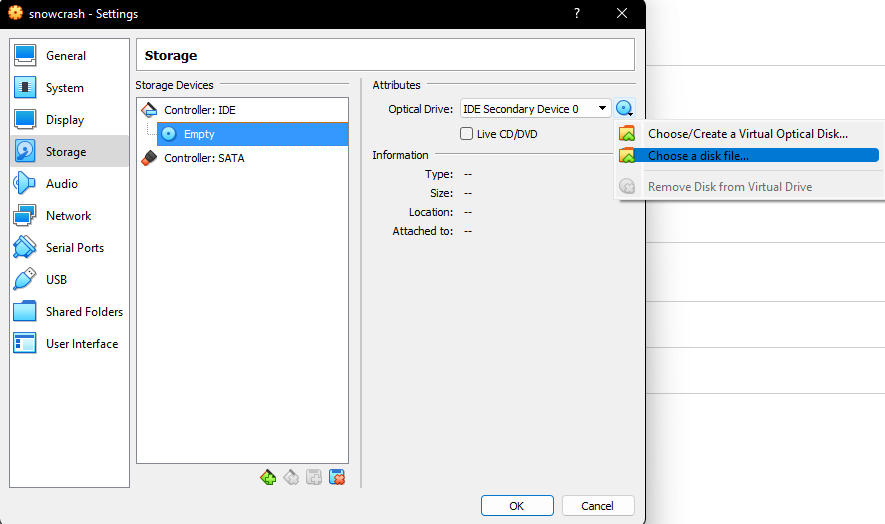

# SnowCrash

42 project which aims to introduce us to computer security.

SnowCrash is a **CTF** like project where you have to solve a challenge in order to get a flag to move on to the next level. There is a total of 15 levels (10 regular levels and 5 bonus levels). 

It will test your knowledge in:
- `UNIX` based systems
- Different programming languages such as `ASM, Perl, Lua, PHP`
- Network packet data analysis
- `Shell` scripting

Of course since this is an introduction none of the exercises are too tricky, that being said some of them are a bit more challenging than others.

# Tips

## Hints

First off, I will remind you that you should try to solve the levels by youself, make sure you have tried **EVERYTHING** before asking for help (*especially if you want to continue this branch of projects*).

For each level there is a folder named `Ressources` which includes a file named `Read.md`, it contains the solution to the level. However, each of those `Read.md` start with a `HINT` and then have an `ANSWER` section. If you are really stuck feel free to take look at the `HINT` section (*I made sure to be as vague as possible*) !

## VM / SSH

As the subject specifies you should use SSH to connect to the VM. However, the video to install and configure the VM is not available on the intranet anymore.
Therefore here are the following steps (**made for on-campus usage**):

	
INSTALL THE VM

		
First, download the ISO file on the intranet <i>(I recommend storing it on your sgoinfre).</i> Once it's downloaded let's create a new VM on VirtualBox, click the <code>New</code> button such as: 
		 
		For the memory size the recommended amount is way enough, the VM is extremely light don't bother giving it extra memory it won't use. 
		For the hard disk choose the <code>Do not add a virtual hard disk</code> option. 
		Now we need to mount the ISO file to the VM we just created, click on the <code>Settings</code> of our VM and then head to the <code>Storage</code> tab. Under <code>Storage Devices</code> you should see a CD icon which say empty, select that and them head over to <code>Attributes</code>, once again click on the CD icon and select the <code>Choose a disk file</code> option such as: 
		 
		Now simply choose the ISO file and Voila !

	
SSH

		
This step is only useful if you are <b>having issues</b> connecting to your VM through SSH from the same computer, if your ip starts with <code>10.1</code> then we're going to have to create a host only network adapter. 
		In VirtualBox, on the top left click on <code>File</code> and then select <code>Host Network Manager</code> from the drop down menu, from there just click on the <code>Create</code> button and your adapter should appear such as: 
		 
		Now we just go back to the settings of our VM and head to the <code>Network</code> tab, we need to change the <code>Attached to</code> from <code>NAT</code> to <code>Host-Only Adapter</code> and select our newly created adapter from the <code>name</code> drop down menu, such as: 
		 
		You should now be able to connect to your VM through SSH ! <b>This is not the only way to do this just an example of what I did, do what works best for you !</b>

## Tools

We heavily recommend using the following tools / commands:
- **GDB** *(Please take the time to learn how to use it, seriously !)*
- **strings**
- **Wireshark**
- **curl**
- **netcat**

You will also have to write your own programs / scripts to solve the levels. Pick whichever language works best for you. 
Good luck and enjoy !

## MADE WITH LOVE BY :

<!-- ALL-CONTRIBUTORS-LIST:START - Do not remove or modify this section -->
<!-- prettier-ignore-start -->
<!-- markdownlint-disable -->
<table>
  <tr>
    <td align="center"><a href="https://github.com/execrate0/"> <b>execrate0 (ahallain)</b></a> </td>
    <td align="center"><a href="https://github.com/assxios/"> <b>Assxios (droge)</b></a> </td>
  </tr>
</table>
<!-- markdownlint-restore -->
<!-- prettier-ignore-end -->
<!-- ALL-CONTRIBUTORS-LIST:END -->
