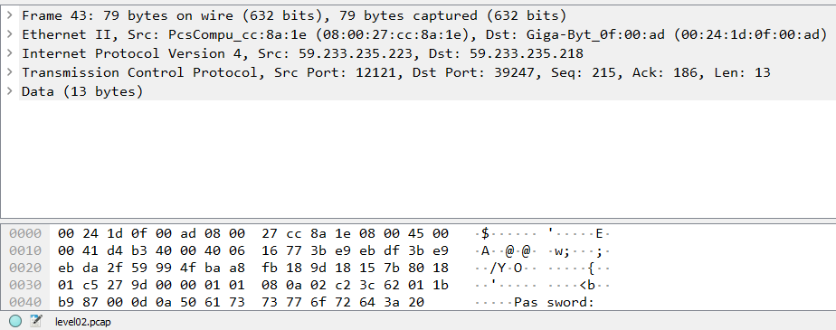

# Level02

## Hint

Open the `pcap` file with Wireshark and check the contents of the packets.

## Answer

Let's check our current directory:
```
level02@SnowCrash:~$ ll
total 24
dr-x------ 1 level02 level02  120 Mar  5  2016 ./
d--x--x--x 1 root    users    340 Aug 30  2015 ../
-r-x------ 1 level02 level02  220 Apr  3  2012 .bash_logout*
-r-x------ 1 level02 level02 3518 Aug 30  2015 .bashrc*
----r--r-- 1 flag02  level02 8302 Aug 30  2015 level02.pcap
-r-x------ 1 level02 level02  675 Apr  3  2012 .profile*
```

Great ! We found a `pcap` *(packet capture)* file, we want open it with Wireshark, to do that we need to `scp` it to our machine and give it the correct permissions:
```
scp -P 4242 level02@192.168.157.130:/home/user/level02/level02.pcap .
chmod +r level02.pcap
```

Now we can open it with Wireshark, after looking at the contents of the packets we notice that the packet number **43** has the string "password":



After that packet we notice that every other `[PSH, ACK]` packet contains a single byte of data, which is presumably when put together the password. Here is the what we receive when reconstructed and transformed from hex to ascii:
```
f t _ w a n d r 127 127 127 N D R e l 127 L 0 L 13
```

It appears to have non printable characters, so we need to take them into account. 127 is the ascii code for `DEL`, so we need to delete the characters preceding those and 13 is the ascii code for `Carriage Return`, meaning that it is the end of the password.<br>
So our final password is:
```
ft_waNDReL0L
```

Alright let's login to `flag02`:
```
level02@SnowCrash:~$ su flag02
Password:
Don't forget to launch getflag !
flag02@SnowCrash:~$ getflag
Check flag.Here is your token : kooda2puivaav1idi4f57q8iq
```
